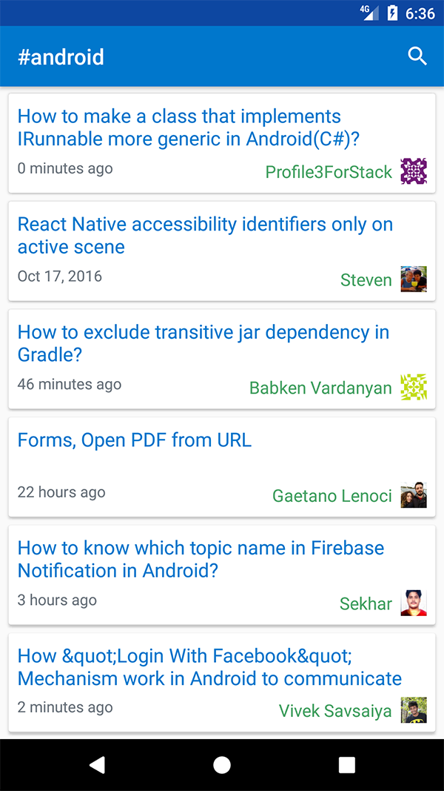

## MVP with Android architecture components

  
An Android project with MVP pattern which adapts with new Android architecture components introduced in Google IO 2017.    
It provides lifecycle-aware Presenter with support of LifeCycle and local data source handled by Room (an abstraction layer over SQLite).

**Blog post**: [Android MVP with new Architecture Components](https://blog.mindorks.com/android-mvp-with-new-architecture-components-7627b7cb8491)

This demo project uses StackExchange API as a remote data source.
It loads and shows all newest Android questions.  
  

### Libraries:  
* Architecture Components: [Room](https://developer.android.com/reference/android/arch/persistence/room/package-summary.html) + 
[Lifecycle](https://developer.android.com/reference/android/arch/lifecycle/package-summary.html).
* [RxJava 2](https://github.com/ReactiveX/RxJava) + [RxAndroid](https://github.com/ReactiveX/RxAndroid)
* [Dagger 2](https://github.com/google/dagger)
* [ButterKnife](https://github.com/JakeWharton/butterknife)
* [Timber](https://github.com/JakeWharton/timber)
* [Retrofit](https://github.com/square/retrofit) + [OkHttp](https://github.com/square/okhttp)
* [Glide](https://github.com/bumptech/glide)
* UI: RecyclerView, CardView, ConstraintLayout.
* Unit Testing: [JUnit4](https://github.com/junit-team/junit4) +
 [Mockito](https://github.com/mockito/mockito) +
 [Hamcrest](https://github.com/hamcrest/JavaHamcrest)
* Developer Debugging Tools: [Stetho](https://github.com/facebook/stetho) +
 [LeakCanary](https://github.com/square/leakcanary)
### License
This project is available under the MIT license. See the LICENSE file for more info.
